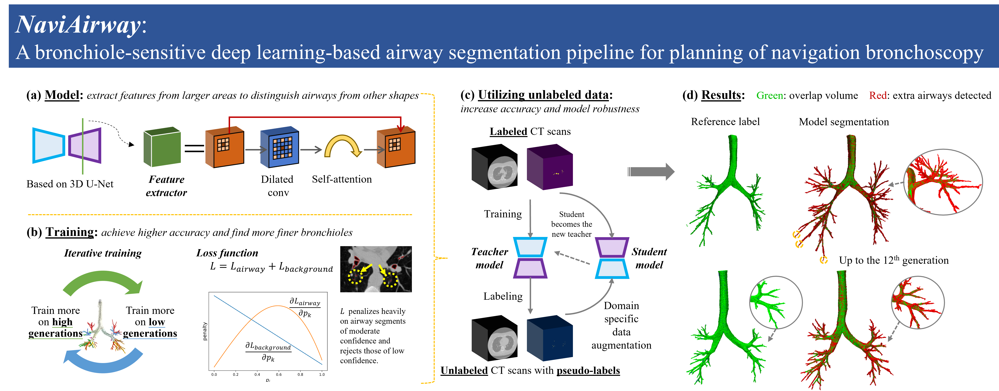

# NaviAirway

> [**NaviAirway: a Bronchiole-sensitive Deep Learning-based Airway Segmentation Pipeline**](https://arxiv.org/abs/2203.04294), ***Preliminary version presented at RSNA2021***.

Airway segmentation is essential for chest CT image analysis. However, it remains a challenging task because of the intrinsic complex tree-like structure and imbalanced sizes of airway branches. Current deep learning-based methods focus on model structure design while the potential of training strategy and loss function have not been fully explored. Therefore, we present a simple yet effective airway segmentation pipeline, denoted NaviAirway, which finds finer bronchioles with a bronchiole-sensitive loss function and a human-vision-inspired iterative training strategy. Experimental results show that NaviAirway outperforms existing methods, particularly in identification of higher generation bronchioles and robustness to new CT scans. Besides, NaviAirway is general. It can be combined with different backbone models and significantly improve their performance. Moreover, we propose two new metrics (Branch Detected and Tree-length Detected) for a more comprehensive and fairer evaluation of deep learning-based airway segmentation approaches. NaviAirway can generate airway roadmap for Navigation Bronchoscopy and can also be applied to other scenarios when segmenting fine and long tubular structures in biomedical images.

## Pipeline

<div align="center">
    
</div>

## Demonstration (code, data, and instruction)

[OneDrive](https://connecthkuhk-my.sharepoint.com/:f:/g/personal/wangad_connect_hku_hk/EjlGACUxa4VJmHs8BHBEEAEBDz4cy8pbj3aw_tt51uwV3w?e=Y7wwbf) password: ```2333```

[Google Drive](https://drive.google.com/drive/folders/1bLHvFTUswgrNc64tQ00L_K63TzdksB5r?usp=sharing)

## Dependencies

- Check the required python packages in `requirements.txt`.

## Datasets

- [**EXACT09**](http://image.diku.dk/exact/)


The file structure should be like this

```
/data/Airway/EXACT09
    /Training
        /CASE01
            /1093782
            /1093783
            ...
        /CASE02
        ...
    /Testing
        /CASE21
        ...
```

- [**LIDC-IDRI**](https://wiki.cancerimagingarchive.net/display/Public/LIDC-IDRI)

The file structure should be like this

```
/data/Airway/LIDC-IDRI
    /LIDC-IDRI-0001
        /1.3.6.1.4.1.14519.5.2.1.6279.6001.298806137288633453246975630178
            /1.3.6.1.4.1.14519.5.2.1.6279.6001.179049373636438705059720603192
                /1-001.dcm
                /1-002.dcm
                ...
    /LIDC-IDRI-0002
    ...
```

## Run the code

- **[Note]** Folder ```dataset_info``` contains data info used for training scripts. You can read the sample files in that folder to learn the format.

- **[Dataset preparation]**

    - Download the two datasets: EXACT09 and LIDC-IDRI.

    - Run ```dataset_preprocess_EXACT09.ipynb``` and ```dataset_preprocess_LIDC-IDRI.ipynb``` to preprocess the images.

    - Run ```Pre_crop_images.ipynb``` to pre-crop the images to be samll cubes.

    - Run ```Get_dataset_info.ipynb``` to generate dataset info (our iterative training strategy (training with focus on airways of low and high generations iteratively) is achieved by it).

- **[Training]** Run ```train.py``` or ```train_semi_supervised_learning.py``` to start training. You can change the hyperparameters. Model parameters are saved in ```checkpoint```.

- **[Inference]** Run ```NaviAirway_pipeline.ipynb```.

## Results

See the 3D models in ```results```.

## Contact

If you have any questions, please contact ```wangad@connect.hku.hk```.
