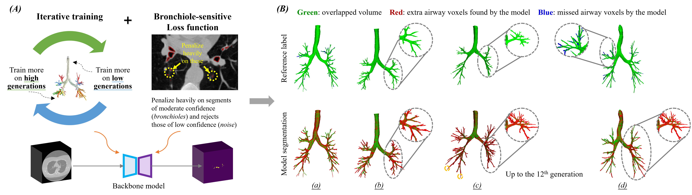

# NaviAirway
*NaviAirway: a Bronchiole-sensitive Deep Learning-based Airway Segmentation Pipeline for Planning of Navigation Bronchoscopy*

See the [preprint](https://www.techrxiv.org/articles/preprint/NaviAirway_a_Bronchiole-sensitive_Deep_Learning-based_Airway_Segmentation_Pipeline_for_Planning_of_Navigation_Bronchoscopy/19228296) at techrxiv.

The full code will be made publicly available soon.

<div align="center">
    
</div>

## Demonstration (code, data, and instruction for demonstration)

[OneDrive](https://connecthkuhk-my.sharepoint.com/:f:/g/personal/wangad_connect_hku_hk/EjlGACUxa4VJmHs8BHBEEAEBDz4cy8pbj3aw_tt51uwV3w?e=Y7wwbf) password: ```2333```

[Google Drive](https://drive.google.com/drive/folders/1bLHvFTUswgrNc64tQ00L_K63TzdksB5r?usp=sharing)
